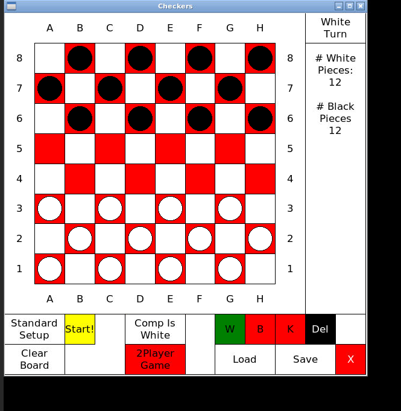

# CS 499 Capstone Final Project
## Seth Porter | SNHU

### Code Review
Due to the various time conflicts with my other course and my fulltime software engineering job, I was unable to commit to a thirty minute code review video.

### Project 1: Software Engineering and Design
The artifact is a C++ application. It processes a text file with one word per line and offers a menu-driven interface with four functions: 1) Count the occurrences of a user-defined word (ignoring case), 2) Show all words alongside their frequency counts, 3) Visualize word frequencies using asterisks, and 4) Exit the program. Improvements include case-insensitive search functionality, validation to ensure words contain only letters, and robust file error handling, all coded using vectors and loops to align with the original program’s structure.

I chose this artifact for my ePortfolio because it showcases a key milestone from my computer science capstone, illustrating my ability to build an interactive C++ program that handles file input and delivers clear, useful output. This project demonstrates my proficiency in file management, input validation, and structured program design—essential skills for software development. Its intuitive menu interface and enhanced features highlight my capability to produce reliable, user-friendly applications while maintaining consistency with a specified coding approach.

Please view the Software Engineering and Design for more details here: [Algorithms and Data Structure Folder](https://github.com/SethPorterCoder/SethPorterCoder.github.io/tree/main/Software%20Design%20and%20Engineering)

### Project 2: Algorithms and Data Structures
The artifact is a Python-based checkers game AI, implemented in the Checkers class using a graphics library.  It supports an interactive 8x8 checkers game for both singleplayer and multiplayer modes, though this submission focuses solely on the singleplayer functionality. The AI, driven by the CompTurn method, uses a heuristic algorithm to choose moves by prioritizing tactics like defending the back row, capturing opponent pieces, promoting pawns to kings, and ensuring safe moves. The game board is represented by a 2D list of Tile objects, with added features such as saving/loading game states and undoing moves. Enhancements include boundary checks and an undo feature to enhance reliability and user experience, while preserving the original code’s structure.

I included this checkers AI in my ePortfolio because it highlights my ability to refine algorithms and data structures within a game-based framework. This artifact showcases sophisticated algorithmic decision-making and efficient use of data structures, skills essential for effective software development.

Please view the Algorithms and Data Structure for more details here: [Algorithms and Data Structure Folder](https://github.com/SethPorterCoder/SethPorterCoder.github.io/tree/main/Algorithms%20and%20Data%20Structures)




### Project 3: Databases
Unfortuntely I was unable to find any database projects from previous courses on my computer.  Instead, I’ll discuss potential enhancements I could apply to my personal projects, drawing on insights gained from my professional experience.

Below are concise improvements for using MySQL stored procedures in my personal projects, aligning with my skills in secure coding and optimization from projects like my checkers AI and C++ word frequency program.

Centralize Logic: Move complex logic, like user authentication, to stored procedures to simplify my application code and ensure consistency, similar to my Phalcon-based work.

Enhance Security: Use parameterized procedures to prevent SQL injection, building on secure input handling from my web projects.

Optimize Performance: Implement batch processing for bulk operations, like saving game moves, to boost efficiency, as I did in my checkers AI.

Add Error Handling: Include error handling and logging in procedures for better debugging, mirroring the reliability focus in my C++ program.

Streamline Data Retrieval: Use procedures with conditional logic for efficient queries, supporting scalable data handling in my social networking algorithms.

Here is a procedure I used recently for a personal project of mine that included authenticating users for my personal LLM server.
```
DELIMITER //
CREATE PROCEDURE SecureUserLogin(IN p_username VARCHAR(50), IN p_password VARCHAR(255), OUT p_result INT)
BEGIN
    DECLARE user_exists INT;
    SELECT COUNT(*) INTO user_exists
    FROM users
    WHERE username = p_username AND password_hash = SHA2(p_password, 256);
    SET p_result = IF(user_exists = 1, 1, 0);
END //
DELIMITER ;
```

In comparison, before my job, I would have stored this logic on a backend server like express.js or springboot.  This here keeps the logic on the server and it creates an execution plan for the database.  This will improve security, code readability, and database performance (theoretical)

### Professional Self-Assessment
Completing my Computer Science program and developing my ePortfolio has been instrumental in highlighting my strengths, refining my professional goals, and preparing me for a career in software development.  Through coursework and hands on projects, I’ve developed skills critical to the field, which enforced strengths in writing efficient, secure, and user focused code.  My professional values emphasize collaboration, clear communication, and continuous learning, which I aim to bring to a dynamic development team, attributes I bring to my real world job now.

Collaboration in a Team Environment: Working on group projects, such as a collaborative web application for a course, taught me to coordinate tasks using SVN and Agile methodologies, ensuring seamless integration of code. My role as a software developer at my company further refined my ability to align with team goals, contributing to a PHP-based system while incorporating feedback from team manager.

Data Structures and Algorithms: My coursework on algorithms, including implementing sorting techniques like quicksort, deepened my understanding of efficient problem solving.  I applied this in a personal project optimizing an algorithm, reducing runtime complexity by leveraging hash tables for faster lookups.  This was used for a backend project at my job with our MySQL database that returned statitical data from our controllers at customers' factories.

Software Engineering and Database: Maintaining a Phalcon based PHP application at work strengthened my software engineering skills, focusing on modular design.  My exploration of MySQL stored procedures, inspired by job experiences, enhanced my ability to manage complex database operations securely and efficiently.  As a side benefit too, this taught me how to refactor old code to make it more scalable too.

Portfolio Artifacts Overview: My ePortfolio showcases two key artifacts that demonstrate my technical proficiency and problem solving ability.  The first, a C++ word frequency analyzer from my capstone, highlights my skills in file handling, user interaction, and input validation through a menu driven interface.  The second, a Python based checkers AI, showcases my expertise in algorithm design and data structure optimization, with enhancements like undo functionality and boundary checks.  Together, these artifacts illustrate my ability to build reliable, user friendly applications while adhering to specific coding standards.  They reflect my broader competencies in creating efficient, secure, and scalable solutions, preparing me to contribute meaningfully to the computer science field.
